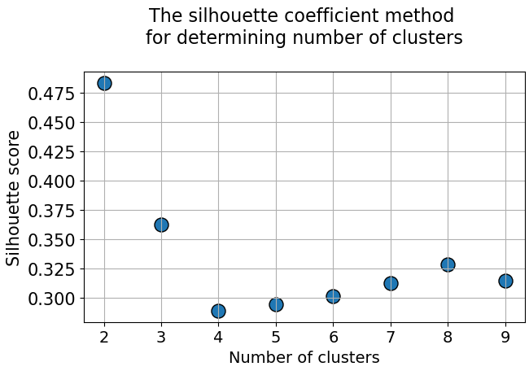
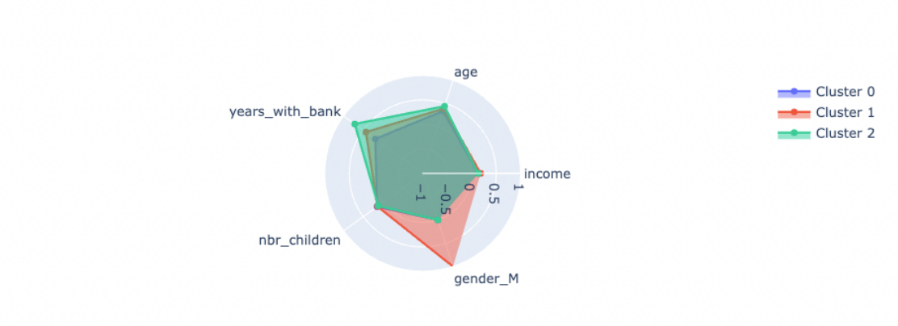

# Clustering Project

## Project/Goals 🎯
Following topics:
- Data Wrangling
- Data Visualization
- Data Preparation and Feature Engineering
- Dimensionality Reduction
- Unsupervised Learning

In this project, two customer segmentations are created using clustering techniques. The first segmentation is based on demographics, utilizing information from the "twm_customer" dataset. The second segmentation focuses on banking behavior, considering factors such as savings account usage, amount saved, credit account usage, debt levels, and transaction patterns. Radar charts are used to visualize and compare the clusters, providing a comprehensive view of each segment's characteristics. Additionally, scatter plots are employed, employing Principal Component Analysis (PCA) to plot observations in a 2D space, offering a visual representation of the segmentations

## Data 📂
We will be using old data about different financial transactions. You can download the data from [here](https://drive.google.com/file/d/1zAjnf936aHkwVCq_BmA47p4lpRjyRzMf/view?usp=sharing). The data contains following tables:

- twm_customer - information about customers
- twm_accounts - information about accounts
- twm_checking_accounts - information about checking accounts (subset of twm_accounts)
- twm_credit_accounts - information about checking accounts (subset of twm_accounts)
- twm_savings_accounts - information about checking accounts (subset of twm_accounts)
- twm_transactions - information about financial transactions
- twm_savings_tran - information about savings transactions (subset of twm_transactions)
- twm_checking_tran - information about savings transactions (subset of twm_transactions)
- twm_credit_tran - information about credit checking (subset of twm_transactions)

## Process ⚙️

1. Exploratory data analysis where we cleaned and wrangled the data 
2. We then did feature engineering and selected our main data features
3. Created radar and PCA charts
4. Found trends  

## Results 📊

We can see that the optimal number of clusters from the above chart is 3

Above is the radar chart which shows the similarieis between the 3 clusters within age, years with bank, income, # of children and gender

